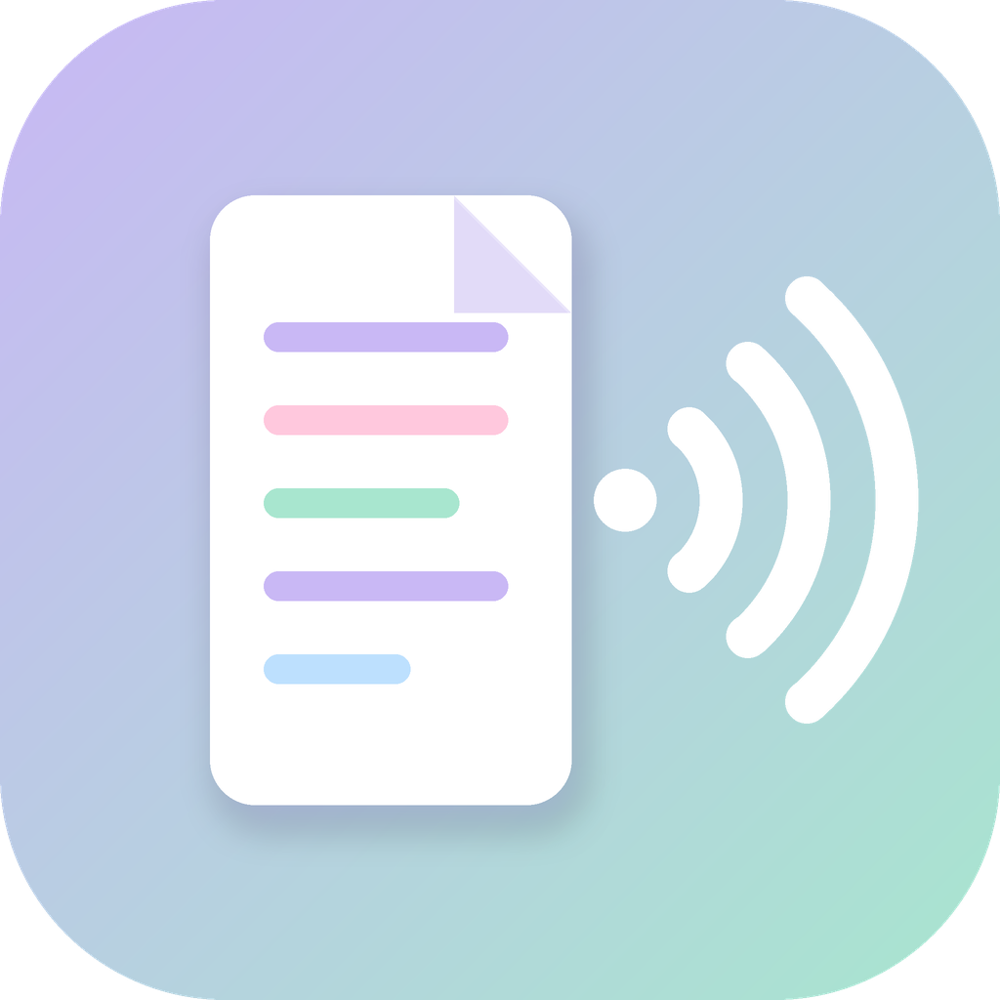

<p align="center"></p>

# DocVoice

문서를 목소리로, 목소리를 문서로. 파스텔 톤 데스크톱 앱 (Windows · macOS · Linux, Python + CustomTkinter)

## 기능

### 1. 문서 → 음성 (mp3)
- 지원 문서: **PDF, DOC/DOCX, XLS/XLSX, PPT/PPTX, HWP/HWPX**, TXT, MD, CSV
- 한국어·영어 자연스러운 **남성 신경망 음성** (Microsoft Edge TTS)
  - 한국어: 인준 / 현수
  - 영어: **미국식**(Guy, Andrew, Brian, Christopher, Eric) · **영국식**(Ryan, Thomas)
- 한·영이 섞인 문서는 문장마다 언어를 판별해 알맞은 목소리로 읽음
- 읽기 속도 조절(0.7~1.4배), 여러 파일 한 번에 변환

### 2. 음성 → 문서
- 받아쓰기: faster-whisper (한국어/영어, 모델 tiny~large-v3)
- 출력 형식 선택: **XLSX / DOCX / PDF / TXT** (복수 선택 가능)
- **XLSX**: 한 문장이 한 행. 영어는 단어 3개 미만 조각("Yes.")을 독립 문장으로 보지 않고 앞 문장에 붙임
- **DOCX / PDF / TXT**: 화자가 바뀌거나, 발언 사이 간격이 설정값(기본 1.5초) 이상이면 줄 바꿈
- 화자 구분: sherpa-onnx (pyannote 분할 + 3D-Speaker 임베딩, CPU), 화자 수 지정 가능

## 설치 · 실행

릴리스 페이지의 `DocVoice-windows.zip` / `DocVoice-macos.zip` 을 받아 압축을 풀고 실행하거나, 소스로 실행:

```bash
# Windows: run_windows.bat 더블클릭   /   macOS: run_mac.command 더블클릭
pip install -r requirements.txt
python -m docvoice            # GUI
```

명령행:

```bash
python -m docvoice tts 보고서.pdf --accent uk
python -m docvoice stt 회의.mp3 --formats xlsx docx pdf --gap 2 --speakers 3
```

## 알아둘 점
- **인터넷 필요**: 음성 합성(Edge TTS)과 최초 모델 내려받기(Whisper, 화자 구분 모델 ≈46MB → `~/.docvoice/models`)
- 스캔본 PDF(이미지)는 텍스트가 없어 읽을 수 없음 (OCR 미지원)
- 구형 `.doc` / `.ppt` 는 LibreOffice가 설치돼 있으면 그것으로 변환해 읽고, 없으면 내장 파서(최선 노력)로 읽음. `.hwp`는 5.x 형식, 암호·배포용 문서는 불가
- 한 오디오 파일은 하나의 언어로 인식(자동 감지는 처음 구간 기준) — 한/영이 섞인 녹음은 언어를 직접 지정하세요
- 화자 구분은 자동 추정이라 틀릴 수 있으니, 결과가 이상하면 화자 수를 지정하거나 끄세요
- PDF 저장 시 나눔고딕(OFL) 글꼴을 내장

## 개발

```bash
pip install -r requirements-dev.txt
python -m pytest -q
python tools/make_icon.py     # 아이콘 재생성
pyinstaller DocVoice.spec     # 실행 파일 빌드
```

`main` 에 푸시하면 GitHub Actions가 테스트 → Windows/macOS 빌드 → 릴리스(태그 `v<버전>`) 생성까지 자동으로 수행합니다. 해당 버전의 릴리스가 이미 있으면 건너뛰므로, 새 릴리스는 `docvoice/__init__.py` 의 `__version__` 을 올려 푸시하면 됩니다.

## 라이선스
MIT. 번들 글꼴: NanumGothic (SIL OFL 1.1, `docvoice/assets/OFL-NanumGothic.txt`).
